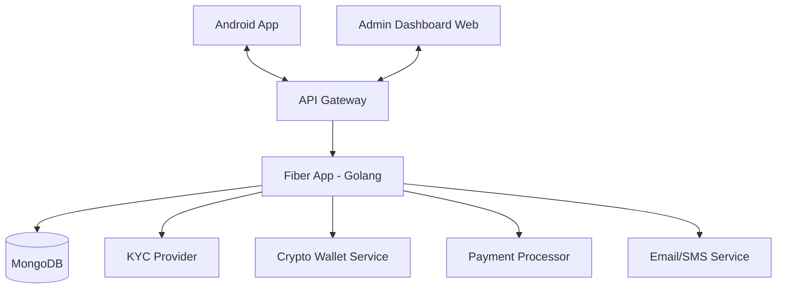
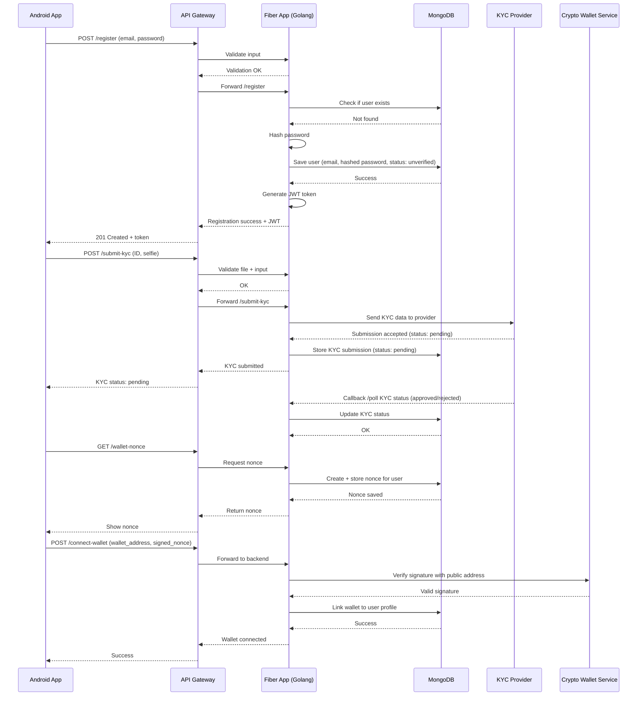
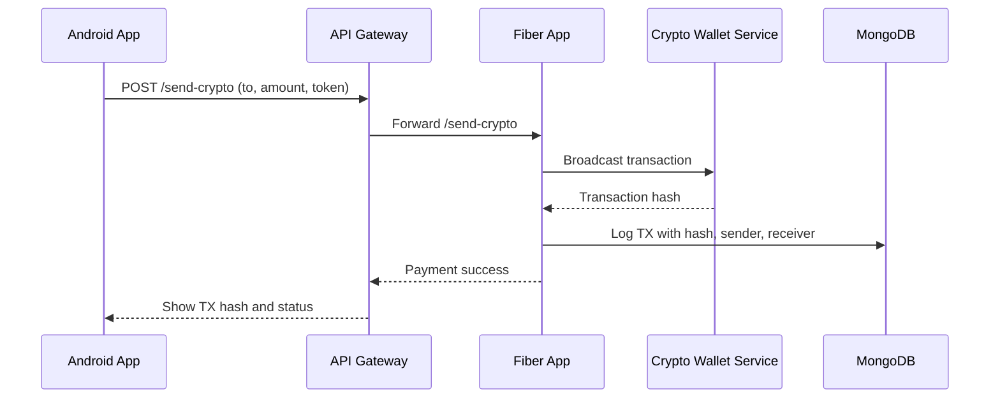
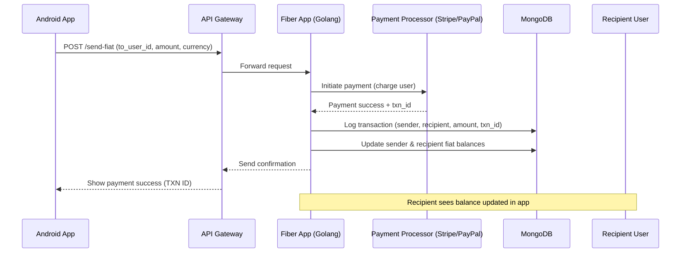
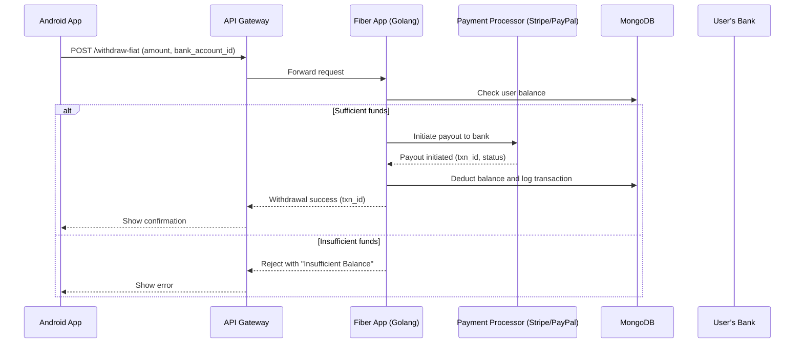
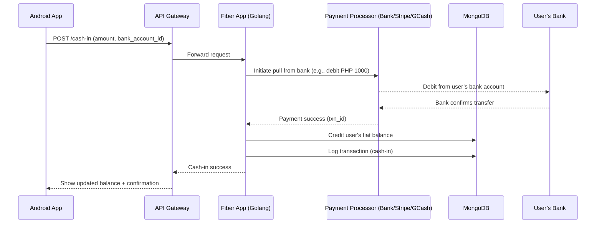
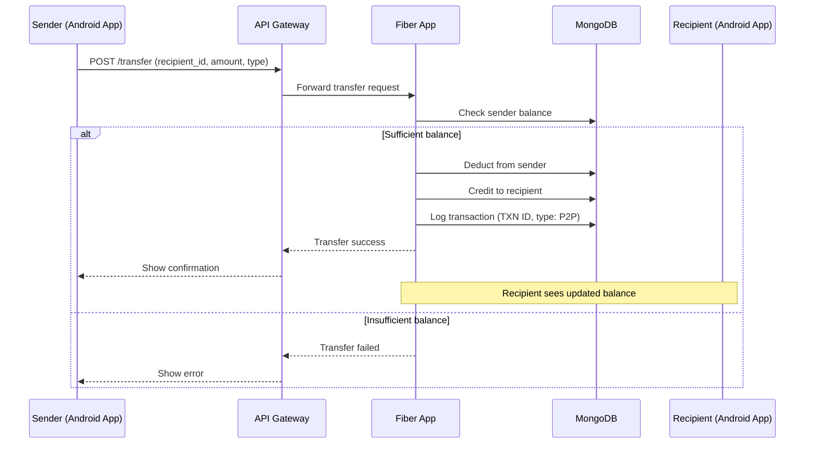
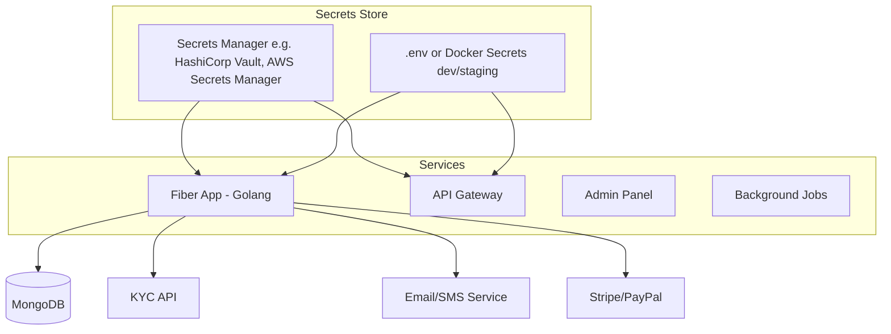
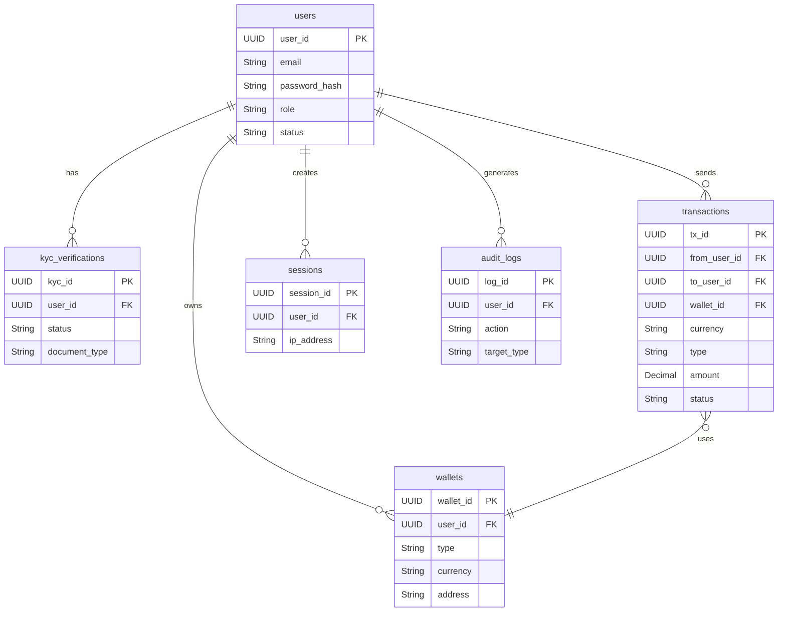

# Tech Stack
For Backend use:
Go(Golang) + Framework (Fiber)

For Frontend use:
Android Studio (Kotlin)

### 📆 Sprint 0: Preparation & Architecture (1 week)

**Objectives:** Establish foundation, align vision, configure environments.

1. **Requirement Analysis & User Stories**

    - Workshop with stakeholders to refine features:

        - User onboarding: registration, email/phone verification.

        - Authentication: password reset, multi-factor support.

        - Payment flows: add/remove payment methods, send/receive funds, view history.

        - Admin: user management, transaction moderation.

        - Non-functional: TLS, OWASP Top 10 compliance, 99.9% uptime.

    - Document 10+ detailed user stories with acceptance criteria (e.g., “Given a verified email, when I provide a valid password, then I receive a JWT and am redirected”).

2. **Tech Stack & Repo Initialization**

    - **Backend:**

        - Initialize Go module (`go mod init github.com/yourorg/payapp`).

        - Install Fiber, GORM, JWT libraries.

        - Scaffold directory structure:

            ```
            /cmd/server
            /internal/app
            /internal/models
            /internal/controllers
            /internal/services
            /migrations
            /config
            ```

    - **Frontend (Android):**

        - Create Android Studio project with Kotlin, minimum SDK 21.

        - Setup MVC folder structure:

            ```
            /model
            /view
            /controller
            /network
            /utils
            ```

    - Initialize GitHub repositories with README, .gitignore, and branch protection rules.

3. **High‑Level Architecture & Diagrams**

- Draw system context diagram (Android , Admin Dashboard ⇄ API Gateway ⇄ Fiber app ⇄ MongoDB).

- Create a sequence diagram for core flows.


- **Crypto Payment**

- **Fiat Payment**

- **Withdrawal to Bank**

- **Cash-In Bank**

- **P2P Transfer (Fiat or Crypto)**

- Define data flow for secrets: where to store API keys, TLS certs (use Vault or `.env`).
- Types of Secrets in Tranzure

| Type                     | Examples                                              |
| ------------------------ | ----------------------------------------------------- |
| **API Keys**             | KYC Provider (e.g. Sumsub), Email/SMS service, Stripe |
| **Private Keys**         | For custodial crypto wallets (if applicable)          |
| **TLS Certificates**     | For HTTPS (SSL/TLS) termination                       |
| **JWT Signing Secrets**  | Used for generating/verifying tokens                  |
| **Database Credentials** | MongoDB URI                                           |
| **Admin Tokens**         | Dashboard authentication                              |

**Secret Data Flow and Storage Strategy**

**Where to Store Secrets (for Each Component)**

| Component                      | Secret Type                        | Secure Storage Strategy                                                                        |
| ------------------------------ | ---------------------------------- | ---------------------------------------------------------------------------------------------- |
| **Fiber App (Golang backend)** | API keys, JWT secret, DB URI       | `.env` file locally, injected via **Docker env**, or **Vault**                                 |
| **API Gateway**                | TLS certs, API keys for validation | Use **reverse proxy config** (e.g. NGINX + mounted certs), secure Vault                        |
| **MongoDB**                    | Connection string                  | Stored in **Fiber env** only                                                                   |
| **TLS/HTTPS certs**            | SSL cert, private key              | Store in mounted volume or use **Let's Encrypt** auto-renew with **Certbot**                   |
| **Crypto Wallets (custodial)** | Private keys or mnemonic           | **NEVER in source code**, store in **HashiCorp Vault**, **AWS KMS**, or **GCP Secret Manager** |

**Secret Handling Flow :**



**Best Practices (Secrets Handling)**

**Development & Deployment:**

|Best Practice|How|
|---|---|
|**No hardcoded secrets**|Never commit `.env` or config files with secrets to Git|
|**Use `.env` in dev only**|For local dev, store secrets in `.env`, use `godotenv` in Go|
|**Docker Secrets**|Use `docker secrets` or `docker-compose.override.yml` for staging/prod|
|**Kubernetes**|Use `Secrets` with RBAC + encrypted volumes|
|**HashiCorp Vault (recommended for scaling)**|Secure secret lifecycle + dynamic keys per environment|

**Example `.env` File (Local Dev Only):**

```
MONGO_URI=mongodb://localhost:27017
JWT_SECRET=supersecretjwtkey
KYC_API_KEY=your-sumsub-key
STRIPE_SECRET_KEY=your-stripe-secret
EMAIL_API_KEY=your-mailgun-key
```

> Important: Use `.env.example` (without secrets) for version control.

**TLS Certificate Flow**

**For production HTTPS:**

|Option|How to Manage|
|---|---|
|**Reverse proxy (e.g. NGINX)**|TLS termination handled by NGINX, certs in `/etc/ssl/`|
|**Let's Encrypt + Certbot**|Auto-renew + mounted volumes|
|**Cloud provider TLS**|Use AWS ACM, GCP Certificate Manager, etc.|
Always redirect HTTP → HTTPS on the API Gateway or Load Balancer.
Tools Recommendation

| Tool                                         | Purpose                                   |
| -------------------------------------------- | ----------------------------------------- |
| **Dotenv / godotenv**                        | Load `.env` into Go backend               |
| **HashiCorp Vault**                          | Secure, role-based secrets management     |
| **AWS Secrets Manager / GCP Secret Manager** | Cloud-native alternative to Vault         |
| **Docker Secrets**                           | Encrypt secrets for containerized deploys |
| **Certbot**                                  | Automated TLS with Let's Encrypt          |

4. **Development Environment & CI/CD**
    - **Local Setup:** Docker Compose YAML with services:
        - `app` (Go + Fiber), `db` (Mongo db), `adminer`.
    - **CI Pipeline:** GitHub Actions to run:
        - `go fmt`, `go vet`, `golangci-lint` (backend).
        - `./gradlew lint`, `./gradlew test` (Android).
    - Setup staging branch that deploys to a test VPS via Docker.

**Deliverables:** Requirements doc, architecture diagrams, skeleton codebases, CI green badge.

---

### Sprint 1: Core Data Models & Persistence (1–2 weeks)

**Objectives:** Model database, implement ORM, basic CRUD for Users.

1. **Database Design & Migrations**
    - Finalize ERD with fields, types, constraints:
**Users**

| Field           | Type                    | Notes          |
| --------------- | ----------------------- | -------------- |
| `user_id`       | UUID                    | Primary Key    |
| `email`         | String                  | Unique         |
| `password_hash` | String                  | bcrypt         |
| `role`          | Enum(`user`, `admin`)   | Access control |
| `status`        | Enum(`active`,`banned`) | Account state  |
| `created_at`    | Timestamp               |                |
| `updated_at`    | Timestamp               |                |
**kyc verifications**

| Field              | Type                                    | Notes                  |
| ------------------ | --------------------------------------- | ---------------------- |
| `kyc_id`           | UUID                                    | Primary Key            |
| `user_id`          | UUID                                    | Foreign key to `users` |
| `status`           | Enum(`pending`, `approved`, `rejected`) |                        |
| `document_type`    | String                                  | e.g., passport         |
| `submitted_at`     | Timestamp                               |                        |
| `reviewed_at`      | Timestamp                               |                        |
| `rejection_reason` | String                                  | Optional               |

**wallets**

| Field        | Type                   | Notes                              |
| ------------ | ---------------------- | ---------------------------------- |
| `wallet_id`  | UUID                   | Primary Key                        |
| `user_id`    | UUID                   | FK to `users`                      |
| `type`       | Enum(`crypto`, `fiat`) |                                    |
| `currency`   | String                 | e.g., `USD`, `BTC`, `ETH`          |
| `address`    | String                 | Crypto address or bank account ref |
| `balance`    | Decimal                | Optional for fiat                  |
| `is_primary` | Boolean                |                                    |
**transactions**

| Field          | Type                                 | Notes                    |
| -------------- | ------------------------------------ | ------------------------ |
| `tx_id`        | UUID                                 | Primary Key              |
| `from_user_id` | UUID                                 | Sender                   |
| `to_user_id`   | UUID                                 | Recipient                |
| `wallet_id`    | UUID                                 | Wallet used              |
| `type`         | Enum(`fiat`, `crypto`)               |                          |
| `currency`     | String                               |                          |
| `amount`       | Decimal                              |                          |
| `status`       | Enum(`pending`, `success`, `failed`) |                          |
| `tx_hash`      | String                               | On-chain hash for crypto |
| `metadata`     | JSON                                 | Escrow, fees, etc.       |
| `created_at`   | Timestamp                            |                          |

**sessions**

| Field         | Type      | Notes |
| ------------- | --------- | ----- |
| `session_id`  | UUID      |       |
| `user_id`     | UUID      |       |
| `ip_address`  | String    |       |
| `device_info` | String    |       |
| `login_at`    | Timestamp |       |
| `expires_at`  | Timestamp |       |

**audit_logs**

| Field         | Type      | Notes                      |
| ------------- | --------- | -------------------------- |
| `log_id`      | UUID      |                            |
| `user_id`     | UUID      | Who performed the action   |
| `action`      | String    | Description                |
| `target_type` | String    | "kyc", "transaction", etc. |
| `target_id`   | UUID      |                            |
| `created_at`  | Timestamp |                            |




- Write initial SQL migration scripts or use GORM AutoMigrate with manual review.
2. **Backend Model Implementation**
    - Create Go structs in `internal/models` with GORM tags and JSON annotations.
    - Set up config loader (Viper) for DB connection strings.
    - Unit test model validation logic (e.g., non-null constraints).
3. **Service & Repository Layer**
    - Define repository interfaces (e.g., `UserRepo.Create(ctx, User) error`).
    - Implement repository using GORM in `internal/services/user_service.go`.
    - Write unit tests using SQLite in-memory for repositories.
4. **Initial Controller & Routing**
    - Setup Fiber app in `cmd/server/main.go`, load config, connect DB.
    - Register `/health` endpoint returning JSON `{status: "ok"}`.
    - Add `/users` POST endpoint to create users; use service layer.
    - Middleware: logging (Fiber logger), recover (Fiber recover).
5. **Frontend Model Mapping**
    - Create Kotlin data classes in `/model`: `User`, `Wallet`, etc., matching JSON.
    - Setup Retrofit + Moshi or Gson for JSON parsing; define `ApiService` interface.
6. **Stub UI Screens**
    - Add LoginActivity, RegisterActivity layouts (XML) with basic form fields.
    - Controller stubs: button click logs to console.
**Checkpoints:**

- DB tables exist and CRUD via Go tests.
- POST /users works (tested via Postman).
- Kotlin Retrofit setup can fetch from `/health`.
---

### Sprint 2: Authentication & Security (2 weeks)

**Objectives:** Secure signup/login, token management, session security.

1. **Backend Auth Implementation**

    - Add `bcrypt` for password hashing.

    - Endpoints in `controllers/auth_controller.go`:

        - `POST /auth/register` → hash password, create user, return 201.

        - `POST /auth/login` → verify hash, issue access (15m) & refresh (7d) JWT tokens.

        - `POST /auth/refresh` → validate refresh token, issue new access.

    - JWT config: secret rotation strategy, claims including `sub` (user ID), `iat`, `exp`.

    - Middleware: `Authenticate` checks `Authorization: Bearer` header and sets `ctx.Locals("user_id")`.

2. **Token Storage & Revocation**

    - Create `RefreshToken` model/table: token hash, user_id, expires_at.

    - On login, store refresh token; on logout or rotate, delete old tokens.

3. **Frontend Auth Flow**

    - Retrofit `AuthService` with register, login, refresh endpoints.

    - Securely store tokens in EncryptedSharedPreferences.

    - Interceptor for OkHttp to attach `Authorization` header.

    - Activity results: success navigates to MainActivity; failure shows error toast.

4. **Security Hardening**

    - Enforce HTTPS for all requests; disable cleartext in `network_security_config.xml`.

    - Implement rate limiting in Fiber (e.g., `github.com/gofiber/fiber/middleware/limiter`).

    - CORS policy: allow only Android client origin or use API keys.

5. **Testing**

    - Backend unit tests: invalid password, expired token, unauthorized access.

    - Android instrumented tests: login flow, token persistence.


**Deliverables:** Secure auth endpoints, token lifecycle, Android login/register flows.

---

### 💳 Sprint 3: Payment Method Management (1–2 weeks)

**Objectives:** CRUD operations for payment methods, secure storage.

1. **Backend Model & Migration**

    - Update `PaymentMethod` struct with fields: `provider` (Visa/Mastercard/Bank), `masked_number`, `expiry_date`, `meta JSON`, `user_id FK`, `created_at`.

    - Migration script to add table with `CHECK` constraints on expiry format.

2. **Controllers & Services**

    - Endpoints in `payment_method_controller.go`:

        - `GET /payment-methods` → list current user’s methods.

        - `POST /payment-methods` → validate payload, encrypt sensitive fields using AES-256, store.

        - `DELETE /payment-methods/:id` → soft-delete (set `is_active=false`).

    - Service layer: ensure only owner can CRUD their methods.

3. **Encryption & Key Management**

    - Generate symmetric key stored via environment variable or Vault.

    - Implement util functions for `encrypt()`, `decrypt()` in `internal/utils/crypto.go`.

    - Write tests to ensure decryption matches plaintext.

4. **Android UI & Controller**

    - **Add Payment Method Screen**:

        - Form with provider dropdown, number (input mask), expiry picker, CVV.

        - Client-side validation (length, Luhn check).

    - **Payment Method List**:

        - RecyclerView with CardView items showing masked number & expiry.

        - Swipe-to-delete with confirmation dialog.

5. **Networking & Error Handling**

    - Retrofit calls for GET, POST, DELETE; use sealed classes for response states.

    - Global ErrorHandler: map 400/401/500 to user-friendly messages.


**Acceptance Criteria:**

- CRUD flows tested end-to-end (Postman + Android emulator).

- Encryption verified via DB inspection.


---

**(Continued)**

---

### 💸 Sprint 4: Core Payment Flow (2 weeks)

**Objectives:** Implement the end-to-end send/receive payment mechanics and status tracking.

1. **Model & Migration Updates**

    - Extend `Transaction` struct:

        - Add `reference_id` (UUID), `description` (string), `fee` (decimal).

        - Ensure `status` enum includes `pending`, `completed`, `failed`, `cancelled`.

    - Create migrations for new fields and index on `from_wallet` and `to_wallet`.

2. **Service Layer & Business Logic**

    - Implement `TransactionService.Create(ctx, fromID, toID, amount, methodID)`:

        - Check sender balance; apply reserved holds; calculate fees.

        - Insert record with `status=pending` and publish event to `transaction_queue`.

    - Create worker in `internal/services/transaction_worker.go`:

        - Listen to queue (e.g., Redis or in-memory pub/sub) to settle transactions.

        - On success: deduct/add balances atomically in a DB transaction; update status to `completed`.

        - On failure: release holds; update status to `failed`; log error.

3. **Controller & Routing**

    - Add endpoints in `transaction_controller.go`:

        - `POST /transactions` → validate input, call `TransactionService.Create`, return `reference_id` and initial `status`

        - `GET /transactions/:id/status` → return current status

        - Webhook stub `POST /transactions/webhook` for external settlement callbacks

    - Middleware: ensure only authenticated users access these endpoints.

4. **Frontend UI & Controller (Android)**

    - **Send Payment Screen**:

        - Form fields: payee selection (search/autocomplete), amount input (decimal keyboard), method dropdown.

        - Confirmation dialog summarizing `amount + fee` and `to` details.

    - **Payment Status Screen**:

        - Poll `/transactions/:id/status` every 5s until `completed` or `failed` (max 1 min).

        - Display animated loader; on final status show success/failure with details.

5. **Error Handling & Edge Cases**

    - Handle network timeouts, server errors with retry/backoff.

    - Display clear UX for `insufficient funds`, `invalid method`, `timeout`.

    - Idempotency: client should handle duplicate submissions safely (use `reference_id`).


**Acceptance Criteria:**

- Transactions move from `pending`→`completed` in DB and UI reflects each state.

- Failure paths (insufficient funds, worker error) update status and surface clear messages.


---

### 📊 Sprint 5: Transaction History & Analytics (1–2 weeks)

**Objectives:** Provide users with paginated history and summary metrics.

1. **Backend Pagination & DTOs**

    - Extend `TransactionController`:

        - `GET /transactions` with query params `?page=&limit=&sort=&from=&to=` filters by date range and pagination.

    - Create `TransactionHistoryDTO` and `DashboardSummaryDTO`:

        - History item: `reference_id`, `type` (sent/received), `amount`, `fee`, `status`, `timestamp`, `counterparty`.

        - Summary: `total_sent`, `total_received`, `average_fee` for given period.

    - Optimize queries with `OFFSET`/`LIMIT` and appropriate indexes; consider keyset pagination for large datasets.

2. **Analytics Service**

    - Implement `AnalyticsService.GetSummary(userID, period)`:

        - Aggregate sums and averages

        - Cache results for 5 minutes in Redis

3. **Endpoints & Security**

    - `GET /transactions/history` → returns paginated `TransactionHistoryDTO`

    - `GET /dashboard/summary?period={daily,monthly,yearly}` → returns `DashboardSummaryDTO`

4. **Android UI & Controller**

    - **History Screen**:

        - RecyclerView with `PagedListAdapter` for infinite scrolling.

        - Date filter UI (calendar pickers) and sort toggle (asc/desc).

    - **Dashboard Screen**:

        - Card views showing `total_sent`, `total_received`, `average_fee`, with icons.

        - Pull-to-refresh to update metrics.

5. **Testing & Performance**

    - Backend integration tests for pagination filters and summary accuracy.

    - Android UI tests (Espresso) for scrolling and date filters.


**Acceptance Criteria:**

- Users can browse history by page, filter by date, sort results.

- Dashboard shows correct summary metrics matching DB aggregates.


---

### 🔍 Sprint 6: Validation, Error Handling & Localization (1 week)

**Objectives:** Harden validation, unify error flows, support multiple locales.

1. **Backend Validation**

    - Integrate `fiber/middleware/validator` or use `go-playground/validator`:

        - Validate request structs for all endpoints (`required`, `email`, `min`, `max`, `pattern`).

    - Centralize error formatting middleware:

        - Convert all errors to `{code, message, field_errors}` JSON.

2. **Android Error Framework**

    - Create `ErrorHandler` singleton:

        - Maps API error codes to user messages via `strings.xml`.

    - Implement field-level error highlighting in forms.

3. **Localization**

    - Backend: return `error_code` keys.

    - Android: `strings.xml` for English + placeholder for other languages (e.g., Tagalog).

    - Populate Tagalog translations for core UI texts and error messages.

4. **Edge Case Flows**

    - Test invalid JWT, expired tokens → redirect to login.

    - Test invalid input formats (card number, amount, email).

    - simulate network failures → show retry dialogs.


**Acceptance Criteria:**

- All user flows validated; no unhandled errors.

- App displays localized strings for core screens and errors.


---

### 🚀 Sprint 7: Testing, QA & Documentation (2 weeks)

**Objectives:** Achieve high quality via automated tests, manual QA, and thorough docs.

1. **Automated Tests**

    - **Backend:**

        - Unit tests for services: user, auth, transactions, analytics.

        - Integration tests with testcontainers (Postgres + Redis).

        - API contract tests using Postman/Newman.

    - **Frontend:**

        - Unit tests for controllers/ViewModels with JUnit + Mockito.

        - Instrumentation tests (Espresso) for critical flows: login, add method, send payment, view history.

2. **Manual QA**

    - Test on multiple device emulators and real devices (API 21–30).

    - Security review: pen test basic auth flow, SQLi, XSS (in case of embedded webviews).

    - UX review: form layouts on different screen sizes.

3. **Documentation**

    - **Backend:** API reference generated via Swagger/OpenAPI; publish to internal Confluence or GitHub Pages.

    - **Android:** Code docs with KDoc; README with setup and architecture overview.

    - Developer onboarding guide: how to run locally, code style, commit conventions.

4. **Acceptance & Sign‑off**

    - Demo to stakeholders covering all core features.

    - Collect feedback and log new backlog items.


**Deliverables:** Test reports, Swagger docs, QA checklist, signed-off MVP.

---

### 📦 Sprint 8: Deployment, Monitoring & Ops (1 week)

**Objectives:** Move to production, establish monitoring, and prepare release.

1. **Containerization & Deployment**

    - Finalize `Dockerfile` for Go app: multi-stage build, healthcheck.

    - Docker Compose for staging and production override files (with real secrets via Vault).

    - Helm chart or Kubernetes manifests if using k8s.

2. **CI/CD to Production**

    - GitHub Actions workflows:

        - On `main` merge: build images, push to registry, deploy to staging.

        - Manual approval gate → deploy to production.

3. **Monitoring & Alerting**

    - Integrate Prometheus exporters in Fiber (metrics middleware).

    - Grafana dashboard for request rates, error rates, latency.

    - Alertmanager rules for high error rate (>5% over 1m), latency (>500ms).

    - Sentry integration for panic/error tracking.

4. **Android Release**

    - Generate signed APK/AAB; configure versioning policy.

    - Upload to Google Play Console (internal test track → closed beta).

    - Release notes and test instructions.

5. **Post‑Launch Support**

    - On-call schedule for rapid response to incidents.

    - Run load test (k6) against production endpoints; compare with staging.

    - Collect user metrics (Google Analytics, Firebase) for crash reporting and usage.


**Acceptance Criteria:**

- Production environment serving live traffic.

- Monitoring alerts configured and tested.

- Android beta build available to test users.


---

**Ongoing Iterations & Backlog**

- Add refunds, recurring payments, currency conversion.

- Enhance security: HSM for keys, SOC2 audit prep.

- UX polishing: animations, dark mode, offline mode.

- Scale enhancements: read replicas, query optimization, pub/sub migration.


**Next Steps:** Prioritize backlog based on user feedback and compliance requirements.